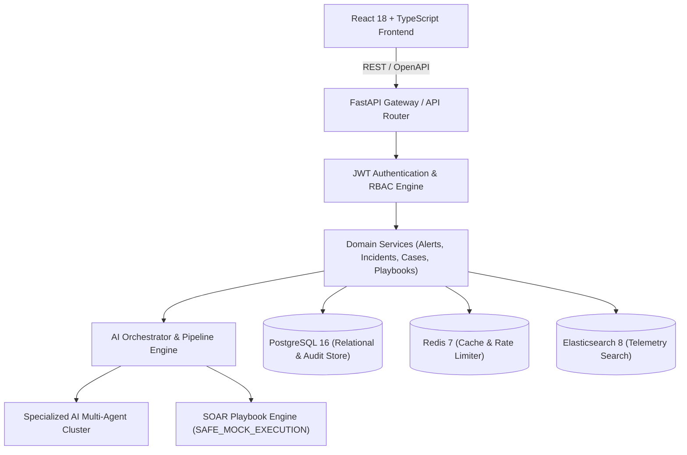
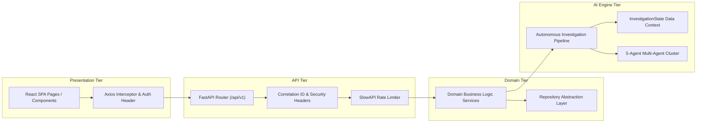
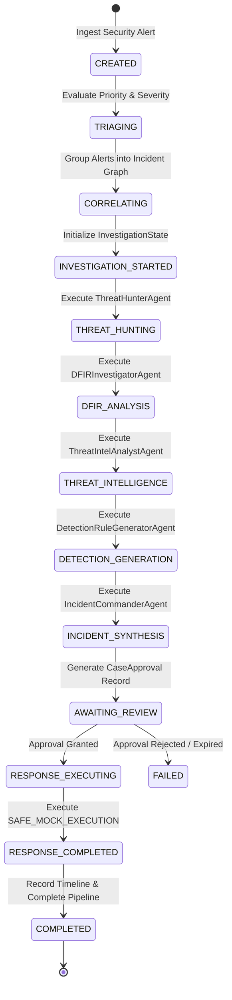
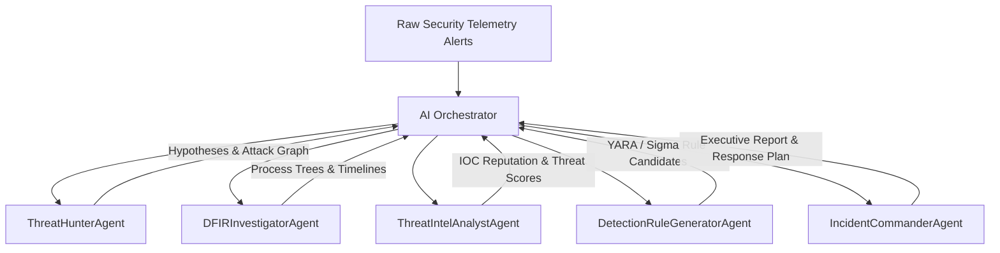
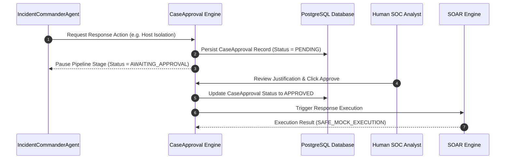
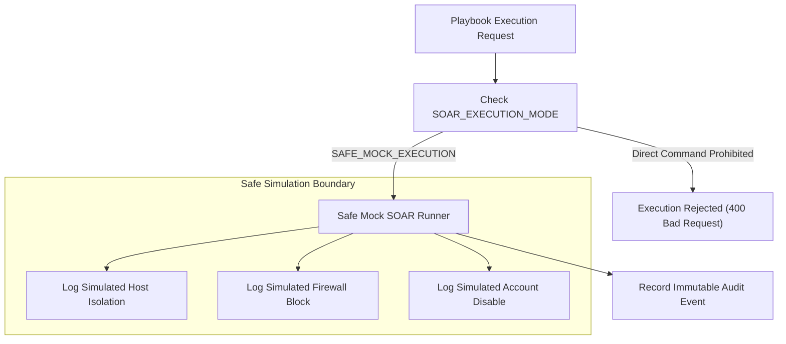
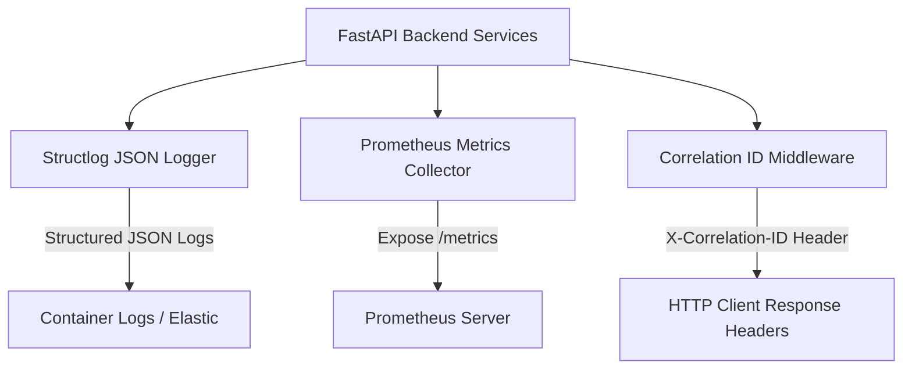
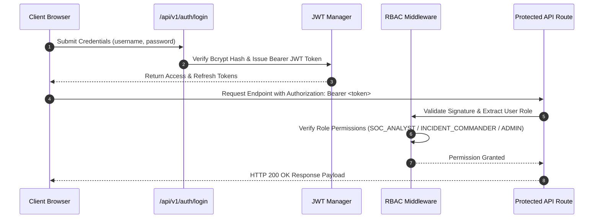
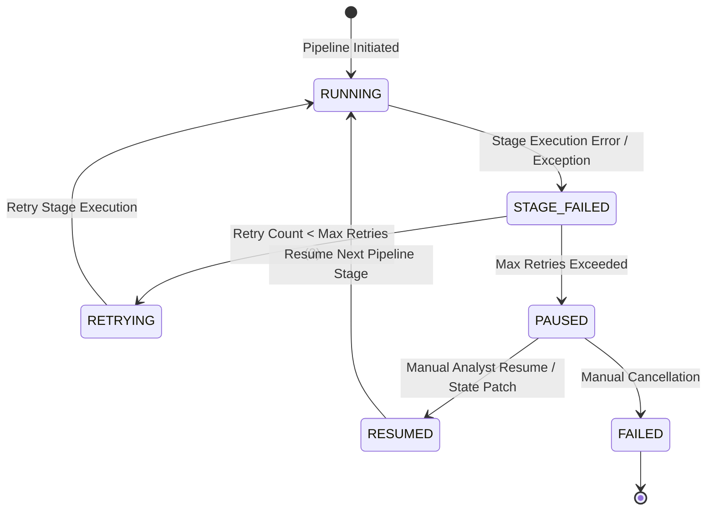

# AegisAI XDR — System Architecture Specifications

This document outlines the system architecture of the **AegisAI XDR** platform. All diagrams and specifications reflect the actual source code implementation across `backend/app/`, `frontend/src/`, and `tests/`.

---

## 1. High-Level System Architecture



---

## 2. Frontend → API → Domain → AI Tiered Architecture



---

## 3. Autonomous Investigation Pipeline (11 Stages)



---

## 4. Multi-Agent Collaboration Workflow



---

## 5. InvestigationState Data Flow

```mermaid
graph TD
    Input["Alert Payload"] --> StateInit["InvestigationState Initialization"]
    
    subgraph Shared Context Object
        StateInit --> AlertsField["alerts: List[Dict]"]
        StateInit --> EvidenceField["evidence: List[Dict]"]
        StateInit --> TimelineField["timeline: List[Dict]"]
        StateInit --> AgentResultsField["agent_results: Dict[str, AgentResult]"]
        StateInit --> RiskField["risk_score: float"]
        StateInit --> RecsField["recommendations: List[str]"]
    end

    Agents["Agent Execution Cluster"] -->|Read / Write Mutate| Shared Context Object
    Shared Context Object --> Persistence["Database Persistence & Serialization"]
```

---

## 6. CaseApproval Governance Gate



---

## 7. SOAR Safety Boundary Architecture



---

## 8. Observability & Analytics Architecture



---

## 9. Authentication & RBAC Authorization Flow



---

## 10. Pipeline Failure & State Machine Recovery Flow


