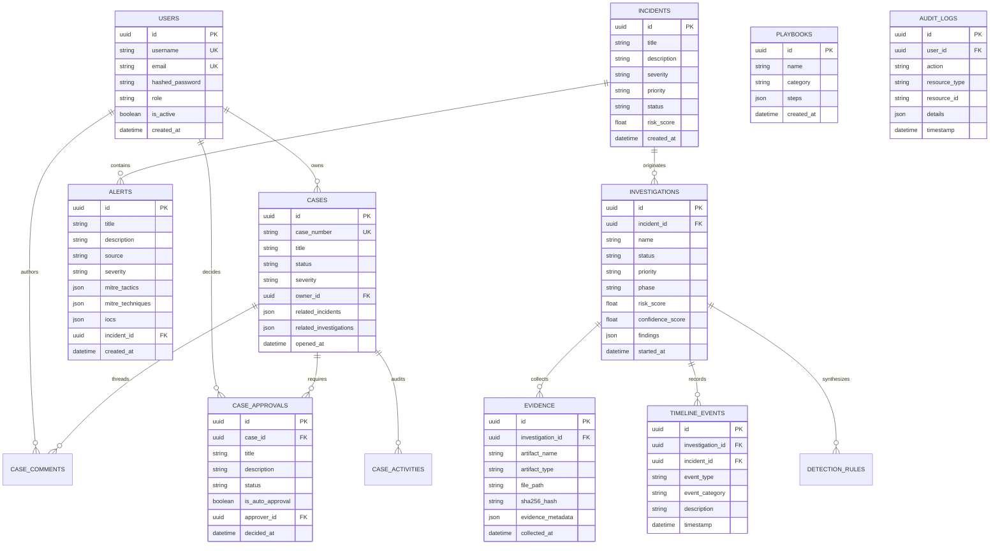

# AegisAI XDR — Database Architecture & Schema Specifications

This document specifies the database models, relations, indexes, migrations, backup routines, and Entity-Relationship (ER) diagram for the **AegisAI XDR** PostgreSQL relational store.

---

## 📐 1. Entity-Relationship (ER) Diagram



---

## 🗄️ 2. Domain Entity Specifications

Implemented in `backend/app/models/` and `backend/app/case_management/models.py`:

1. **`users`**: User account credentials, hashed passwords, roles (`SOC_ANALYST`, `ADMIN`, etc.).
2. **`alerts`**: Ingested security telemetry events with MITRE tactics and IOC lists.
3. **`incidents`**: Correlated incident graphs grouping related alerts.
4. **`investigations`**: Multi-agent investigation lifecycle state and risk scores.
5. **`evidence`**: Forensic artifacts with SHA256 cryptographic hash validation.
6. **`timeline_events`**: Chronological reconstruction events.
7. **`cases`**: Enterprise SOC case workspace records.
8. **`case_approvals`**: Human governance approval records (`PENDING`, `APPROVED`, `REJECTED`).
9. **`detection_rules`**: Generated Sigma, YARA, and Suricata candidate rules.
10. **`playbooks`**: SOAR playbook steps and mock execution configurations.
11. **`audit_logs`**: Immutable audit logs capturing platform activity.

---

## ⚙️ 3. Database Migration Management (Alembic)

- **Registry**: `backend/app/db/base.py` imports all SQLAlchemy models to ensure complete metadata tracking.
- **Migration Configuration**: `backend/alembic.ini` and `backend/app/db/migrations/env.py`.
- **Baseline Migration**: Baseline migration `5d18d07315a7_initial_schema_sprint21.py` contains DDL table definitions.
- **Commands**:
  ```bash
  # Check current revision
  alembic current

  # Run pending migrations
  alembic upgrade head
  ```

---

## 💾 4. Automated Backup & Recovery

- **Script**: `scripts/db_backup.sh`.
- **Functionality**:
  - PostgreSQL `pg_dump` binary execution.
  - MD5 integrity checksum generation.
  - `gzip` compression.
  - Rolling retention policy (prunes backups older than 7 days).
- **Disaster Recovery Guide**: Documented in `docs/backup_and_recovery.md`.
